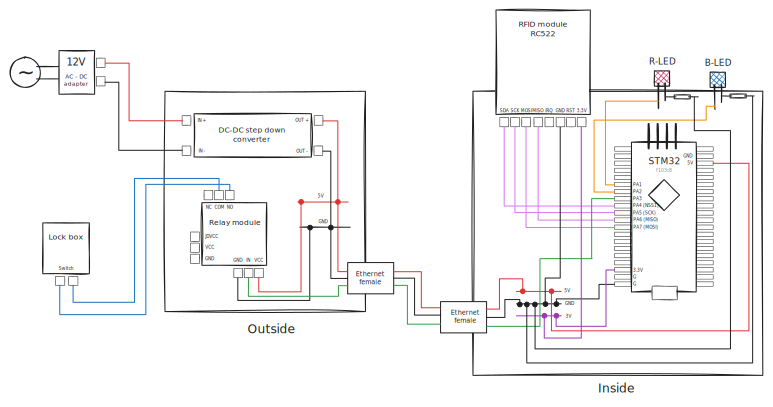

# NFC Door Lock

## Idea
Replace a metal key with an NFC card. An STM32 microcontroller reads the card through an RC522 reader and, if the UID matches, triggers a relay to unlock the door.

## Main Components
| Part | Purpose |
| --- | --- |
| STM32F103 “Blue Pill” | Controls the system and talks to peripherals |
| RC522 RFID reader | Reads NFC / MIFARE cards over SPI |
| 5 V relay module (opto-isolated) | Switches the door-lock circuit |
| LM2596 buck converter | Steps 12 V adapter down to 5 V for the electronics |

## Circuit Diagram

  

